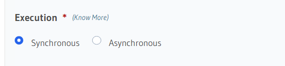

# Hasura Overview

## Table of contents

- [Introduce](#introduce)
    - [Definition](#definition)
    - [Feature](#what-can-hasura-do)
    - [How does Hasura work?](#how-does-hasura-work)
- [Quick start](#quick-start)
- [How to connect and manipulate database by Hasura](#how-to-connect-and-manipulate-database-by-hasura)
- [Add business logic](#add-business-logic)
   - [Action](#action)
   - [Remote schema](#remote-schema)
- [Document](#document)

## Introduce
### Definition
Hasura is an open-source product that accelerates API development by 10x by giving you GraphQL or REST APIs with built-in authorization on your data, instantly.

### What can Hasura do?
* **Make powerful queries**: Built-in filtering, pagination, pattern search, bulk insert, update, delete mutations
* **Works with existing, live databases**: Point it to an existing database to instantly get a ready-to-use GraphQL API
* **Realtime**: Convert any GraphQL query to a live query by using subscriptions
* **Merge remote schemas**: Access custom GraphQL schemas for business logic via a single GraphQL Engine endpoint. 
* **Extend with Actions**: Write REST APIs to extend Hasura’s schema with custom business logic.
* **Trigger webhooks or serverless functions**: On Postgres insert/update/delete events 
* **Admin UI & Migrations**: Admin UI & Rails-inspired schema migrations
* **Supported Databases**: Supports PostgreSQL (and its flavors), MS SQL Server and Big Query.
* And so on...

### How does Hasura work?
Hasura generates GraphQL API queries, mutations and subscriptions from a single or several database(s). The database is connected using a database URL. It’s possible to merge the API generated from several databases into a single one.

## Quickstart
Currently, you have a couple of options when getting started.
### 1. One-click deployment on Hasura Cloud

The fastest and easiest way to try Hasura out is via [Hasura Cloud](https://hasura.io/docs/latest/graphql/cloud/getting-started/index.html).
- Click on Get Started in Hasura Homepage. 
   Complete form to register new Hasura account.

- After that click New Project button.

- Open the Hasura console

   Click on the button "Launch console" to open the Hasura console.

- Make your first GraphQL query

   Create a table and instantly run your first query. Follow this [simple guide](https://hasura.io/docs/latest/graphql/core/getting-started/first-graphql-query.html).
- Moveover, we can deploy to more platform: Heroku, DigitalOcean, Azure, ...
### 2. Docker deployment

You can use curl or wget to get docker-compose file or docker pull from [Docker Hub](https://hub.docker.com/r/hasura/graphql-engine)

You can refer more in https://hasura.io/docs/latest/getting-started/docker-simple/

## How to connect and manipulate database?
Switch to Data tab, navigate to Data -> Manage and click Connect Database button 

In UI, we have 2 options: 
- Connect to existing database: connect by database URL
- Create New Database: Neon provide service to create database

For using existing database:
- Enter some information need to connect database (display name, database url, ...)
- Then, click Connect Database.
- Finally, you will find all database connection you have in Data Manager

To create table: choose schema you want to create table in. Then click Create Table

   - Enter necessary information to create table

   - Then, you can find table just created in left navbar

To manipulate table: choose table you want in left navbar

In UI for table part, we have some tabs: 
- Browse Rows: view data in table.
- Insert Row: add new item to table.
- Modify: you can modify field, primary key, add foreign key, unique, indexs,...
- Relationship: create relationship between this field in table you're working and field in different table. 
- Permission: create and modify permission for new role.

<i>Note:</i> Hasura supports so many kind of types:
- integers, numerics and floats
- serials and UUID
- characters and text
- date and time
- Boolean
- geometric — such as line, box, path, polygon and circle
- JSON

Refer more at https://hasura.io/docs/latest/schema/postgres/postgresql-types/

## Add business logic

## Action

Actions are a way to extend Hasura's schema with custom business logic using custom queries and mutations. Actions can be added to Hasura to handle various use cases such as data validation, data enrichment from external sources and any other complex business logic.

To create new one, navigate Actions tab -> Click Create button

For each action, there are 4 important parts:
- Type
- Definition
- Handler
- Kind

### Type

We have 2 kind of types: Query and Mutation

### Definition

The action definition consists of the following:
- Action Name: The action will be available as a query or mutation in the GraphQL schema named as the action name.
- Arguments: Arguments are used to pass dynamic values along with the query/mutation.
- Response type: The GraphQL type of the response that the query or mutation will return. 

### Handler

Once you define the action types, you also have to specify the logic to run when the action is executed. This can be done in an HTTP webhook, also called the action handler. It could be a REST endpoint or a serverless function.

You can refer at: https://github.com/hasura/hasura-actions-examples

It contains examples of Actions to perform custom business logic with Hasura. 

### Kind

Mutation Actions are of two kinds:

Synchronous: Sync Actions return a response to the client after receiving a response from the handler.

Asynchronous: Async Actions return an action id as response to the client before receiving a response from the handler and allow the client to subscribe to the actual response using the action id.

Query Actions don't have a kind, they always behave like sync mutation Actions.

### How it work?
- Hasura receive the action GraphQL query or mutation and converts this request into an event payload.
- Then it is deliveried to action handler. The action handler runs (inside this we will excute custom business logic, data validation, data enrichment or transformation, ...) and returns a response.
- The Action response is returned to the client synchronously or asynchronously based on the kind.

### Additional

We have some configuration for Hasura action.
- Add custom timeout for Action (default 30s)
- Add sample env vars and session vars for testing the connector
- Change the method and URL to adapt to your API's expected format.
- Change the payload to adapt to your API's expected format.
- Change the incoming response to adapt to your declared types.

## Remote schema

### Perspective
Hasura gives you CRUD + realtime GraphQL APIs with authorization & access control. However, in many cases, you will need to write APIs (queries, mutations) that contain custom logic. For example, implementing a payment API, or querying data that is not in your database.

### How it work?
Hasura has the ability to merge remote GraphQL schemas and provide a unified GraphQL API. Think of it like automated schema stitching. All you need to do is build your own GraphQL service and then provide the HTTP endpoint to Hasura. Your GraphQL service can be written in any language or framework.

This is what Hasura running with "Remote Schemas" looks like:

### How to create?
To create new one, navigate to Remote Schema tab -> click Add

- Fill necessary information and configuration

For GrapQL Service URL: it's remote GraphQL URL you want to add.

If you want to try out, you can go to https://mocki.io/graphql to use mock GraphQL

- Finally, click Add Remote Schema.
You can find remote schema you just add in API tab.

## Document
- https://hasura.io/docs/latest/index/